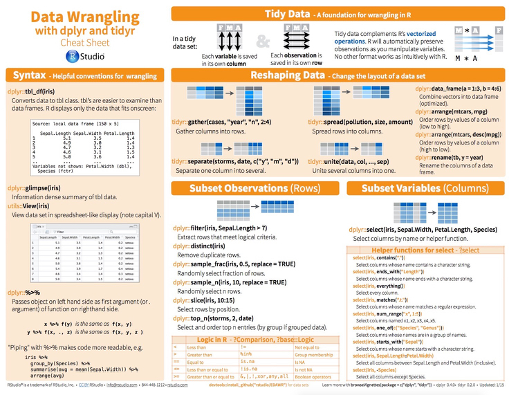
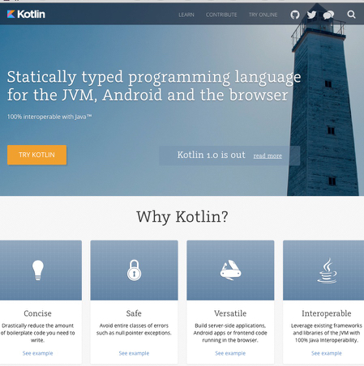
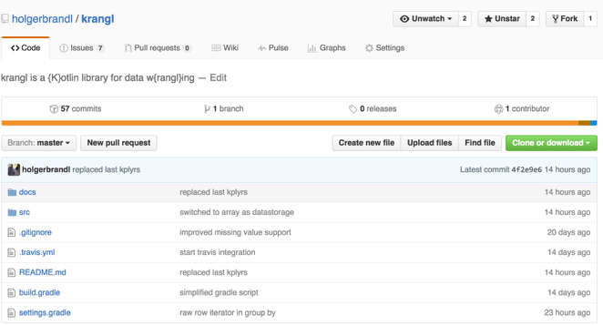
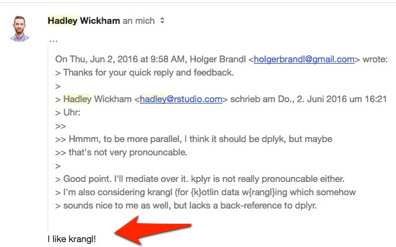

template: inverse
class: middle, center, inverse

# krangl

is a {K}otlin library for data w{rangl}ing.

[https://github.com/holgerbrandl/krangl](https://github.com/holgerbrandl/krangl)

_Holger Brandl_

_6.6.2016 MPI-CBG - BIER_

---

# 90% of Data Science

is just *just* table integration!

---

# Awesome ways to do it. Part 1

`dplyr` A R grammar for data manipulation

```{r}
flights %>%
    group_by(year, month, day) %>%
    select(year:day, arr_delay, dep_delay) %>%
    summarise(
        mean_arr_delay = mean(arr_delay, na.rm = TRUE),
        mean_dep_delay = mean(dep_delay, na.rm = TRUE)
    ) %>%
    filter(mean_arr_delay > 30 | mean_dep_delay > 30)
```


`dplyr` implements the following 5+1 core verbs useful for data manipulation:

* `select()` retains/removes a subset of variables
* `filter()` retains/removes a subset of rows
* `mutate()` derives new columns
* `arrange()` re-orders the rows in a table
* `summarise()` reduces data to a smaller number of summary statistics
* `group_by()` takes a table and converts it into a _grouped table_ where operations are performed by group

---
# R Data Wrangling Cheatsheet

2 pages of condensed awesomeness. (by [Rstudio](https://www.rstudio.com/))

* Organized by task.
* Informative infographics

[](https://www.rstudio.com/wp-content/uploads/2015/02/data-wrangling-cheatsheet.pdf)

---
## Awesome ways to do it. Part2

Python
* [pandas](http://pandas.pydata.org/) is an open source, BSD-licensed library providing high-performance, easy-to-use data structures and data analysis tools!
* [agate](https://github.com/wireservice/agate): is a Python data analysis library that is optimized for humans instead of machines

Shell
* [csvkit](http://csvkit.readthedocs.io/) is a suite of utilities for converting to and working with CSV, the king of tabular file formats.

SQL
* Hard to read and to write as queries beocome more complex
```{sql}
SELECT OrderID, Sum(Cost * Quantity) AS OrderTotal
FROM Orders
GROUP BY OrderID
```

---

## Awesome ways to do it... on the JVM?

[http://stackoverflow.com/questions/20540831/java-object-analogue-to-r-data-frame](http://stackoverflow.com/questions/20540831/java-object-analogue-to-r-data-frame)

* [Joinery](https://github.com/cardillo/joinery): Data frames for Java
    * Rather clumsy syntax
    * Many `dplyr`-verbs are missing and development seems on hold

* [Guava Tables](https://github.com/google/guava/wiki/CollectionUtilitiesExplained#tables) ??
```
// use LinkedHashMaps instead of HashMaps
Table<String, Character, Integer> table = Tables.newCustomTable(
  Maps.<String, Map<Character, Integer>>newLinkedHashMap(),
  new Supplier<Map<Character, Integer>> () {
    public Map<Character, Integer> get() {  return Maps.newLinkedHashMap();  }
  });
```

Seriously for the No1 programming language, what else please  ???


---
# Awesome ways to do it. Apache Spark


* Huge depedency tree
* Too _much_ for many applications
* _Just_ SQL for more complex queries


Query execution model in Spark: The Catalyst query optimizer that creates the physical Execution Plan:


---
# Spark Example

```{scala}
val auction = sc.textFile("ebay.csv").map(_.split(",")).map(p =>
Auction(p(0),p(1).toFloat,p(2).toFloat,p(3),p(4).toInt,p(5).toFloat,p(6).toFloat,p(7),p(8).toInt )).toDF()

auction.show()
// auctionid  bid   bidtime  bidder         bidderrate openbid price item daystolive
// 8213034705 95.0  2.927373 jake7870       0          95.0    117.5 xbox 3
// 8213034705 115.0 2.943484 davidbresler2  1          95.0    117.5 xbox 3 …

// How many auctions were held?
auction.select("auctionid").distinct.count
// Long = 627

auction.groupBy("item", "auctionid").count.agg(min("count"), avg("count"),max("count")).show

// MIN(count) AVG(count)        MAX(count)
// 1  16.992025518341308 75

// Get the auctions with closing price > 100
val highprice= auction.filter("price > 100")
// highprice: org.apache.spark.sql.DataFrame = [auctionid: string, bid: float, bidtime: float, bidder: // string, bidderrate: int, openbid: float, price: float, item: string, daystolive: int]

// // How many  bids per auction? register the DataFrame as a temp table
auction.registerTempTable("auction")
sqlContext.sql("SELECT auctionid, item,  count(bid) FROM auction GROUP BY auctionid, item").show()
// auctionid  item    count
// 3016429446 palm    10
// 8211851222 xbox    28. . .
```


---
# Can we do better?

Requirements
* Easy to learn, use and to extend API
* Eye-friendly
* Strongly-typed as much as possible to allow for good IDE-support

Solution
* Consistent grammar --> Learn from the best!! --> Steal from `dplyr`
* Pick a JVM-language that promises to allow for flexible DSL/API design --> Kotlin


---
# Kotlin




---
# What's so cool about Kotlin?

* Runs on the JVM
* Good at inter-operating with existing java code and libraries.
* Statically typed (thus far far easier to refactor)
* Slightly more evolved type system than Java.
* Nullability is a first class compiler level construct
* Clear system of distinguishing between mutable and immutable structures
* Type inference
* Ability to write extension functions to existing classes
* Support for Higher Order Functions, Higher kinded types

---
# Please welcome: `krangl`

> krangl is a {K}otlin library for data w{rangl}ing.

* By implementing a grammar of data manipulation, it allows to filter, aggregate and reshape tabular data.
* More a technology experiment than a library for now
* Covers all major `dplyr` verbs



---
## Why `krangl` and not `dplyk` or `kplyr`

* Don't stick too much to R conventions but rather embrace Kotlin naming conventions
* _He_ likes it




---
#  Select columns with `select()`

Often you work with large datasets with many columns where only a few are actually of interest to you

`select()` breaks down a data-set to just a subset of columns of interest

```{kotlin}
storms.select("storm", "pressure")
```


---

# `select()`'s little helpers


* It provides a powerful selector syntax.

```{kotlin}
flights.select({ range("year", "day") }, { oneOf("arr_delay", "dep_delay") })
```

* It allows for negative selection, ie it can also drop unwanted columns from our data

```{kotlin}
flights.select({ -"dest" } , { -starts_with("arr") }, {-ends_with("time") })
```

Mini-language similar to  `?select` for a more complete overview


---

# Subset data with `filter()`


`filter()` allows to select a subset of the rows from a table. The first argument is the name of the data frame, and the second and subsequent are filtering expressions evaluated in the context of that data frame:

Which storms had a wind speed greater than 50?

```{kotlin}
storms.filter { it["wind"] gt 50 }
```


---

# Multiple conditions with `filter()`


* Separate multiple filters with a comma (or `&`)
* To filter with OR use a `|`

How many flights flew to Madison in f January?

```{kotlin}
flights.filter { (it["dest"] eq "MSN")  AND (it["month"] eq 1) }
```

Biggest limitation of `krangl`: Limited operator [overloading support](https://www.google.de/webhp?sourceid=chrome-instant&ion=1&espv=2&ie=UTF-8#q=operator%20overloading%20kotlin) in Kotlin
* no vectorization
* Designed as such on on purporse to avoid scala-operator mess


---
# Add new columns with `mutate()`


As well as selecting from the set of existing columns, it's often useful to add new columns that are functions of existing columns.  This is the job of `mutate()`

### What was the speed of the planes?
```{kotlin}
flights.mutate("speed" to { it["distance"]/it["air_time"] * 60 })

```

* `it["distance"]` refers to the complete column and not just to a row value. Thus column arithmetics are supported as well

    ```{kotlin}
    flights.mutate(
        "speed" to { it["distance"]/it["air_time"] * 60 },
        "speed_norm" to { it["speed"] - it["speed"].mean() },
    )
    ```
* Also note that the newly created attribute is used in the same `mutate()` call to create further attributes

---
# Reorder rows with `arrange()`


Sort storms by maximum wind speed

```{r}
storms.arrange("wind")
```

* TBD: Use `desc(wind)` to order a column in descending order
* If more than one column name is provided, each additional column will be used to break ties in the values of preceding columns.


---
# Condense data with `summarise()`


`summarise()` collapses a table to just a single row.

Applied to grouped data it will collapse each group into one row.

```{kotlin}
flights.summarize(
    "mean_arr_delay" to { it["arr_delay"].mean(removeNA = true) },
    "mean_dep_delay" to { it["dep_delay"].mean(removeNA = true) }
)
```

* Bundled summary functions are `sum`, `min`, `max`, `mean`, `median`,`var` or `sd`

---
# Split-apply with `group_by()`


In `krangl`, grouping is its own action. It is done as its own step in the pipeline.

Once data is grouped, `filter`, `mutate` and `summarise` will be applied for each group separately

Calculate mean flight delays for each carrier
```{kotlin}
val flightsGrpd  = flights.group_by("carrier")
flightsGrpd.summarise( delay to  { it["dep_delay"].mean() })
```


---
# Chained Workflow Example

_krangl_ your data by simply chaining operations together:

```{kotlin}
flights
    // group by date
    .groupBy("year", "month", "day")
    // cherry pick columns of interest
    .select({ range("year", "day") }, { oneOf("arr_delay", "dep_delay") })
    // calcualte mean arrival and departure delay
    .summarize(
            "mean_arr_delay" to { it["arr_delay"].mean(removeNA = true) },
            "mean_dep_delay" to { it["dep_delay"].mean(removeNA = true) }
    )
    // find dates with high delays
    .filter { (it["mean_arr_delay"] gt  30)  OR  (it["mean_dep_delay"] gt  30) }
```

---
# Extendability of `krangl` ?


_Method chaining is more succinct, but only the owner of the class can add new methods, insn't it?_

No, everyone can add methods to a class in Kotlin via [extension fuctions](https://kotlinlang.org/docs/reference/extensions.html#extension-functions)

To declare an extension function, we need to prefix its name with a _receiver type_, i.e. the type being extended.

```{kotlin}
fun MutableList<Int>.swap(index1: Int, index2: Int) {
  val tmp = this[index1] // 'this' corresponds to the list
  this[index1] = this[index2]
  this[index2] = tmp
}

val l = mutableListOf(1, 2, 3)
l.swap(0, 2)
```
* No new members into are injected into existing classes,
* Merely make new functions callable with the dot-notation on instances of a class using compiler magic
* 'this' inside 'swap()' will hold the value of 'l'

---
# How to extend `krangl`?

Add cross-tabulation to krangl
```{kotlin}
/** Counts observations by group.*/
fun DataFrame.count(vararg selects: String = this.names.toTypedArray(),
                    countName: String = "n" ) =
    select(*selects)
        .groupBy(*selects)
        .summarize(countName, { nrow })

// use the new extension function
irisData.count("Species")
```

`count()` can be expression as chain of core verbs

Also noteworthy Kotlin features used here
* Expression body function implementation (as compared to java-style block body implementations) with inferred return type
* Default arguments
* Variable argument lists and default parameters


---
# Benchmarking

Using flights example (grouping, aggregation, filtering)

* dplyr: 20ms
* krangl: 0.34 ± 0.02 SD	, N=25

performance difference: > 10x

Even worse performance for current join implementation.

However, initial focus: How close can we come to the `dplyr` API experience when using Kotlin?


---
# Current State & Roadmap

Still missing to become on par with _data wrangling cheatsheet_
* Better reshape support needed: `gather()` and `spread()` --> easy kotlin api because no lambda
* `sample_frac()` and `sample_n()`
* More complete comparison logic
* _window functions_ for column operations with `mutate()`

Soon
* Improve join performance (don't use `reduce` & friends but old-style loops)
* See [https://github.com/holgerbrandl/krangl/blob/master/docs/roadmap.md](https://github.com/holgerbrandl/krangl/blob/master/docs/roadmap.md)
* See [issue tracker](https://github.com/holgerbrandl/krangl/issues)


Later or no clue how to do so
* Embed interactive table view ???
* Index backend for grouped operations (instead of split-backend as of now)
* Add plotting functionailty by mapping ggplot to a kotlin API

---
# Questions, comments?

Thank you for your attention!

### References

* API structure was heavily inspired [dplyr](https://github.com/hadley/dplyr)
* Kotlin features list as presented in [Few thoughts about Kotlin and why I like it so much](http://blog.dhananjaynene.com/2016/04/few-thoughts-about-kotlin-and-why-i-like-it-so-much/)
* Table transformation pics were borrowed from [Data Wrangling with R and RSstudio](https://www.rstudio.com/resources/webinars/data-wrangling-with-r-and-rstudio/)
* [RStudio Data Wrangling Cheatsheet](https://www.rstudio.com/wp-content/uploads/2015/02/data-wrangling-cheatsheet.pdf)
