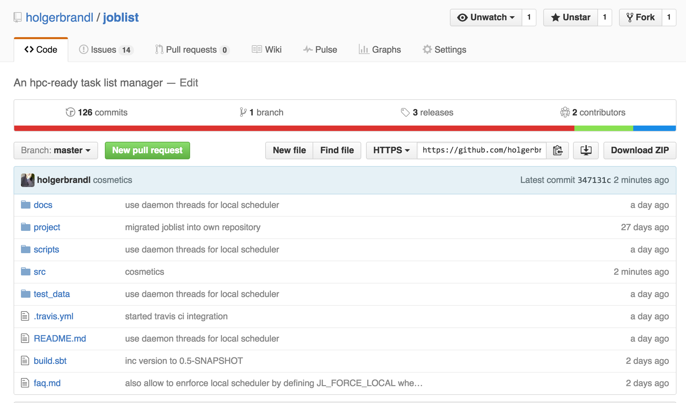

template: inverse
class: middle, center, inverse

# Kplyr

A task list manager for hpc-clusters. Among others it supports monitoring, automatic resubmission, profiling, and reporting of job lists

[https://github.com/holgerbrandl/joblist](https://github.com/holgerbrandl/joblist)

_Holger Brandl_

_14.12.2015 MPI-CBG_

---


# Outline

What -->  Why --> Usecases + Live Examples

---

# Concept

Conceptually JobList `jl` is just managing lists of job-ids as reported by the underlying queuing system
```
>cat .some_jobs 
860671
860681
860686
860688
860691
```

* Processing states: Did they finish? Exit codes?
* Runtime statistics: How long? How much pending When?
* Stderr/out Logs?
* Metrics?

---
# Benchmarking

* Using flights example grouping, aggregation, filtering)
* dplyr: 20ms
* krangl: 0.54 ± 0.02 SD	, N=25


 performance difference: > 100x

However, initial focus: How close can we come to the dplyr API experience when using Kotlin?

---
# Please welcome  ... **JobList**


* Submit, monitor and wait until an entire a list of clusters jobs has finished
* Report average runtime statistics, and predict the remaining runtime of a joblist based on cluster load and job complexities
* Recover crashed jobs and resubmit them again using a customizable set of resubmission strategies.

.image-50[]


---
# Basic Usage

```
> jl --help
Usage: jl <command> [options] [<joblist_file>]

Supported commands are
  submit    Submits a named job including automatic stream redirection and adds
  		  it to the list
  add       Extract job-ids from stdin and add them to the list
  wait      Wait for a list of tasks to finish
  status    Prints various statistics and allows to create an html report for the
  	 	 list
  kill      Removes all queued jobs of this list from the scheduler
  up        Moves a list of jobs to the top of a queue if supported by the 
            underlying scheduler

If no <joblist_file> is provided, jl will use '.jobs' as default
```
* Cover all essential manipulation tasks for a given joblist
* Cross-platform, just requires Java (and optionally R+pandoc) for reporting
* Written in Scala but assembled into self-contained jar-bundle
 
---
# Example: Simple Monitoring

* Use `jl` for blocking and monitoring and final status handling

```bash
bsub "echo foo" | jl add
bsub "sleep 10; echo bar" | jl add
bsub "exit 1"   | jl add

jl wait

if [ -n "$(jl status --failed)" ]; then
    echo "some jobs failed"
fi

jl status --report
```
* Does not change existing workflows but complements them

---
# Example: Submission

```bash
jl submit "sleep 10"          ## add a job
jl submit "sleep 1000"        ## add another which won't fit in our default queue

## wait and resubmit failed/killed jobs to another queue
jl wait
jl resub --queue long
```

* Decouple workflows from underlying queuing system
* Automatic resubmission using different patterns (diff queue, walltime, threads, ...)

--


## Where is the scheduler?

--

Who cares?

---

# Platform Support

`jl` provides (some) abstraction from the underlying queuing system:

--

* LSF

``` bash
jl submit "echo 'hello lsf'"
```

--

* SLURM

``` bash
jl submit "echo 'hello slurm'"
```
 
--

* Any Local Computer

``` bash
jl submit "echo 'hello computer'"
```
* `jl` provides abstraction for common properties but also supports scheduler specific settings
* Total abstraction not feasible and also not desired

???

like custom memory options for 

---
# Bundled In-Place Scheduler

* Takes into account threading settings
* Interruptable
* *Scheduler-Jumping*: change scheduler for existing joblist

```bash
jl submit "sleep 10"
jl submit "sleep 20"

jl wait --report # ctrl-c

## fix something, and try again
jl wait --report

```

* Sidenote: [Its](https://github.com/holgerbrandl/joblist/blob/master/src/main/scala/joblist/local/LocalScheduler.scala) implementation a lovely piece of (multi-threading) art

---
# API 

* `bash` sub-optimal for workflow development, thus use something decent

```scala
import joblist._


val jl = JobList()

jl.run(JobConfiguration("echo foo"))
jl.run(JobConfiguration("echo bar"))

// block execution until are jobs are done
jl.waitUntilDone()

// optionally we could investigate jobs that were killed by the queuing system
val killedInfo: List[RunInfo] = jl.killed.map(_.info)

// resubmit to other queue
jl.resubmit(new OtherQueue("long"))
```
* Also supports Java (or any other JVM language)

---
# Roadmap

* Improve robustness and failure tolerance
* Fix Travis CI integration to let [test suite](https://github.com/holgerbrandl/joblist/tree/master/src/test/scala/joblist) shine
* Improve Java interoperability
* Reporting Improvements (resubmission graph, cpu consumption)
* For complete list see [issue tracker](https://github.com/holgerbrandl/joblist/issues)

???

* Failure tolerance: Occasional 30s plus waiting time for squeue
* More general support for slurm (and not just taurus)

--

Questions, comments? Thank you for your attention!


