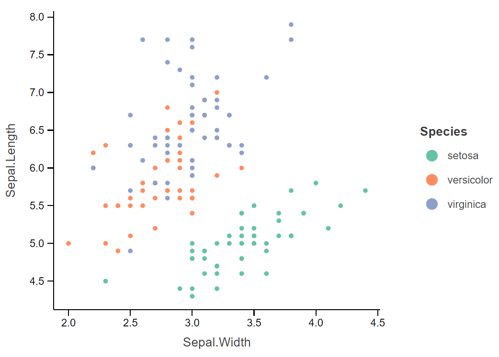

# How to visualize tabular data when using krangl?

There are multiple visualization engines that are compatible with `krangl`.

## lets-plot

[`lets-plot`](https://github.com/JetBrains/lets-plot-kotlin) is an open-source plotting library for statistical data which is written entirely in the Kotlin programming language. 

For new users of krangl, we strongly **recommend** to use `lets-plot` because of its stability and ease of use.

For a fully worked out tutorial see the jupyter workbook [sleep_patterns.ipynb](https://nbviewer.jupyter.org/github/holgerbrandl/krangl/blob/master/examples/jupyter/sleep_patterns.ipynb).


**Example**

```kotlin
import jetbrains.letsPlot.*

irisData.letsPlot{ x= "Sepal.Width"; y="Sepal.Length"; color="Species"}
    + geomPoint()
```




## kravis

`kravis` Implements a grammar to create a wide range of plots using a standardized set of verbs.

`kravis` essentially wrap `ggplot2` from R. The latter it will access via different backends like a local installation, docker or Rserve. It is more versatile compared to `lets-plots` because it supports to full ggplot2 grammar, but relies on [R](https://www.r-project.org/) as non-java binary as dependency.

**Example**


```kotlin
import kravis.* 
import krangl.irisData 

irisData.ggplot("Species" to x, "Petal.Length" to y)
    .geomBoxplot()
    .geomPoint(position = PositionJitter(width = 0.1), alpha = 0.3)
    .title("Petal Length by Species")
```


# Other options

There are great other libaries available, which typically don't work with `krangl` yet, but provide awesome ways to visualize data. See [here](https://github.com/holgerbrandl/kravis#references) for a listing.


